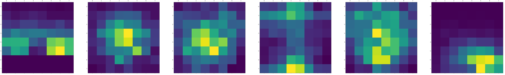
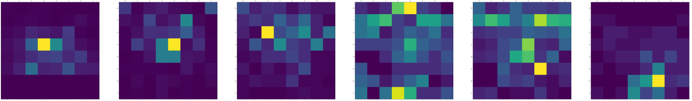
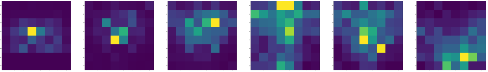
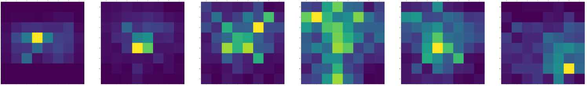

# chess-heatmaps

Heatmap representation of chess moves, it shows the squares that each piece has been moved to more times, it can also show what's the
differences between the moves from each player.

# Usage

I only tested with pgn files from the lichess.org website but most of
them follow the same format. I'll leave in a assets/ folder one example of
a pgn file in case you want to have a look.

Make sure you give a path for the pgn file and the username of the player and  it
will only look for white games as default.

### Options
* -u <username>, username - mandatory to provide
* -p <path>, path to pgn file - mandatory to provide
* -b, look for black games of a certain player, it will only look for white as games as default
* -t <int>, to option - means that it will only consider the first x moves
* -f <int>, from option - it will only search from the x move foorward 
* -l, activate the logarithmic difference between moves. logarithmic
  difference is a cheap way to calcular the ratios between 2 numbers


Here is an example in how you to run the simpler way. 
In this example I'm looking for the white games of the user "jotaalvim" and I also provide a pgn file whith his games
```
$ python densidade.py -u jotaalvim -p assets/lichess_jotaalvim_2022-03-12.pgn
```

Here is an example of the heat map representation of the same user as before
but now it filters the chess moves from the move 20 to the move 40.
```
python densidade.py -f 20 -t 40 -u jotaalvim -p assets/lichess_jotaalvim_2022-03-12.pgn
```
The output is the following:

---

### Outputs
At the moment the output goes to the "ouputs" folder to the heatmap.png file

---


# Dependencies

Make sure you have [jjcli](https://pypi.org/project/jjcli) module instaled, you can install it by:
```
pip install jjcli
```
I also use mathplotlib
```
pip install matplotlib
```

### some generated examples

These are the heatmaps from the knight, bishop, queen, rooks , pawns and the king, respectively, in the player's white games.

---

Heatmaps from a weak player (800 blitz lichess)


---
Heatmaps from a medium/average player (2000 blitz lichess)


Heatmaps from a very strong player (2700 blitz lichess)


---

## It's cool but not that informative
From simply looking at the maps, there's not much information that we can collect, we can perhaps
conclude that the weaker players often move the queen to the more obvious d1-h5
diagonal instead of placing in c2 or d2. Such thigs happen a lot when using different openings. Another, is
that the dark bishop in played fewer times by the weaker and medium players
then by the stronger player. It's impossible to conclude something interesting due to the fact that people are probably playing different openings.

---

## Differences between players 
A more useful and interesting data would be the logarithm differences between 
the moves from each player. Here is an example of the differences between a
stronger and a medium player, in this case the squares more yellow/highlighted are 
squares not played as frequently by the medium player compared to the strong one, 
and therefore tend to be "better" squares for the pieces.


---

## Opening analysis
The heatmap but restricting the search for only the x amount of moves. Here's
an example of the first 10 moves from:

weak player games


---

medium player games


strong player games


--- 

## Where does each piece captures others?
Here's an example of the squares where each piece tends to capture others:






## todo 
 * Where does each piece goes to die
    - Here's an example of the squares where each piece gets captured 
 * Where does each piece stays the longest
