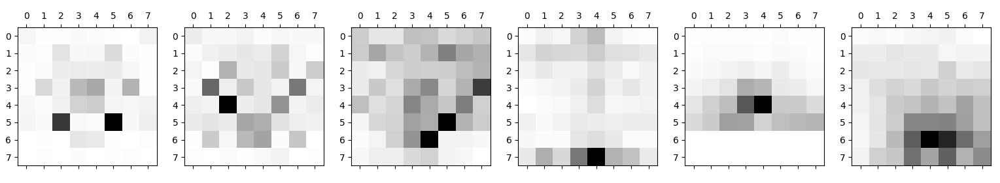
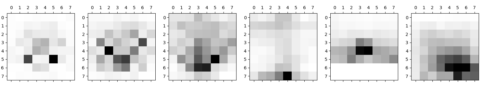
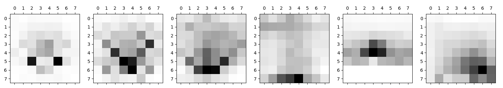

# chess-heat-maps

The darker the color means that a peace have been moved there more times.

This are the heatmaps from the knigth, bishop, queen, rooks , pawns and the king, respectively, in the player's white games.

Heatmaps from a weaker player (800 blitz)

Heatmaps from my ~3000 games on lichess (2000 blitz)

Heatmaps from a very strong player (2700 blitz)

## It's cool but not that informative
For now there's not much information that we can collect, we can perhaps
conclude that the weaker player doesn't care so much for king safety and places it in the center very often.

## Solution
A more useful/interesting data would be the logarithm diferencies between each player sqares 
