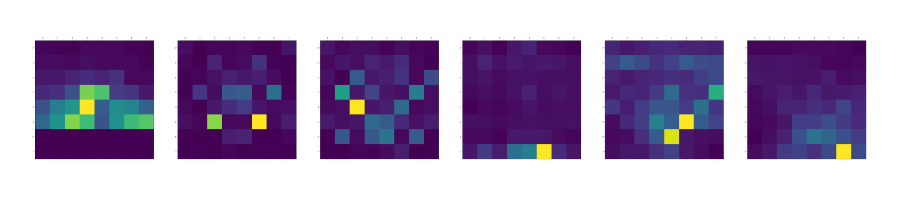
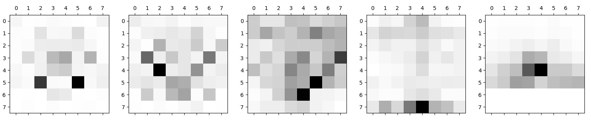
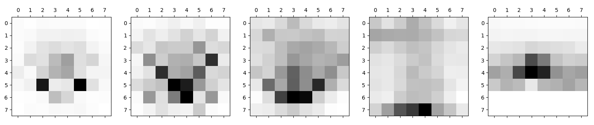

# chess-heatmaps

Heatmap representation of chess moves, it shows the squares that each piece has been moved to more times.

These are the heatmaps from the knight, bishop, queen, rooks , pawns and the king, respectively, in the player's white games.

Heatmaps from a weak player (800 blitz lichess)

Heatmaps from a medium/average player (2000 blitz lichess)

Heatmaps from a very strong player (2700 blitz lichess)

## It's cool but not that informative
From simply looking at the maps there's not much information that we can collect, we can perhaps
conclude that the weaker players often move the queen to the more obvious d1-h5
diagonal instead of placing in c2 or d2. Another thing is
that the dark bishop in played fewer times by the weaker and medium players
then by the stronger player. It's hard to say but those things might be happening due to different openings choices.

## Differences between players 
A more useful and interesting data would be the logarithm differences between 
the moves from each player. Here is an example of the differences between a
stronger and a medium player, in this case the squares more yellow/highlighted are 
squares not played as frequently by the medium player compared to the strong one, 
and therefore tend to be "better" squares for the pieces.

## Opening analysis
The heatmap but restricting the search for only the x amount of moves. Here's
an example of the first 10 moves from the 

weak player 

medium player

strong player

